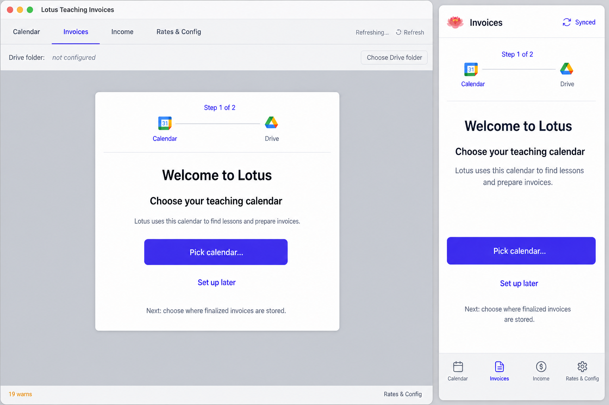

# Required Google Setup Onboarding Design

**Date:** 2026-08-26
**Status:** Draft for review; visual direction approved

## Goal

Make the application's two required external connections explicit:

1. the Google Drive root containing the authoritative configuration and finalized invoices; and
2. the Google Calendar containing lessons.

When either connection is missing, Lotus opens a two-step Welcome wizard. If the user dismisses it, Rates & Config remains usable while Calendar, Invoices, and Income remain visibly disabled. The application unlocks only after both requirements are satisfied.

This also removes Drive setup and unconfigured-state errors from the Invoices tab.

## Approved Visual Direction

The approved direction is the two-step wizard with Calendar and Drive icons in the progress indicator:



The wizard surface, stepper, icons, spacing, and hierarchy are authoritative. The generated background is illustrative only. In the implemented incomplete state, Rates & Config is active; Calendar, Invoices, and Income are disabled; and the Drive-folder control does not remain in Invoices.

## Scope

### Included

- A shared readiness model for desktop and Android.
- A two-step Welcome wizard that opens on each launch while setup is incomplete.
- Calendar and Drive selection from the wizard.
- Calendar and Drive controls grouped at the top of Rates & Config, before Teacher details.
- Disabled desktop tabs and Android bottom-navigation destinations while setup is incomplete.
- A completely empty Invoices tab while Drive storage is unconfigured.
- Drive-root discovery before the user visits Invoices.
- Drive-folder selection that remains possible when invoice-source validation is unavailable or failing.
- Focus, Back/Escape, loading, authorization, and retry behavior for both layouts.

### Excluded

- Changes to Google Drive's remote authority, control-file format, or invoice-number sequencing.
- Changes to Calendar synchronization or invoice calculation after setup is complete.
- Compression or redesign of legitimate invoice-source errors after setup.
- Persistent local caching of Drive root metadata, Drive invoice state, config contents, or onboarding completion. The config file-ID pointer is explicitly allowed.
- A third onboarding step for teacher, bank, studio, or rate details.
- A permanently persisted "do this later" preference.

## Readiness Model

Readiness is derived, not stored as a second configuration authority.

### Calendar requirement

Calendar is configured only when the selected Drive YAML contains a `calendarId` that is accessible to the current Google authorization. A stale/deleted Calendar ID returns setup to Calendar.

### Drive requirement

Drive is configured when both conditions hold:

- current Google authorization includes Drive access; and
- `useDriveInvoices` has a non-null remote `DriveStoreSnapshot` for the current authorization incarnation.

The remote config file remains the only configuration/root authority. The local file-ID pointer selects which remote file to validate; it contains no root or Calendar data. A local onboarding-complete flag must not be added.

### Aggregate state

The application derives one of these states:

- `checking`: local pointer loading, exact Drive lookup/recovery, or Calendar validation has not resolved;
- `incomplete`: Calendar, Drive authorization, or the remote Drive root is missing;
- `ready`: both requirements are satisfied;
- `unavailable`: the initial Drive check failed before a configured snapshot could be confirmed.

`checking` shows the existing centered loading presentation and does not flash the normal app or Welcome wizard.

`unavailable` remains setup-blocking on a cold launch because the pointer is identity only, not cached authority. Retryable failures preserve it. The Drive step shows the specific authorization, network, permission, conflict, or corruption error with Retry. If an already loaded non-null snapshot later encounters a transient offline error, the connection remains configured for navigation-gating purposes; the existing Drive error behavior continues inside the ready application.

## Welcome Wizard

### Entry

After configuration and the initial Drive check resolve, the wizard opens when readiness is `incomplete` or `unavailable`.

The app selects Rates & Config before showing the wizard. The background is dimmed and inert. Drive is always step 1. After a config is selected or an empty folder is staged, Calendar is step 2 only when the recovered/current Calendar is missing or inaccessible.

The wizard reappears on every later launch until setup is complete. Dismissal is held only in React state for the current app session.

### Step 1: Drive

Copy:

- Title: `Welcome to Lotus`
- Step heading: `Choose your invoice folder`
- Body: `Lotus stores finalized invoices in this Google Drive folder.`
- Primary action: `Pick Drive folder…`
- Secondary action: `Set up later`
- Footer: `Next: choose your teaching calendar if needed.`

With a valid local pointer, startup loads that exact Drive file and skips discovery. Without one, discovery shows `Found existing configuration in “<folder>”` and requires confirmation even for one candidate; multiple candidates each have a direct selection action. A selected folder containing a valid config uses the same confirmation flow. An empty selected folder is staged only in memory and advances to Calendar without creating a config.

Cancelling the folder browser returns to Drive. Authorization/discovery errors remain on Drive and provide Retry; retryable errors never clear the pointer.

### Step 2: Calendar

Copy follows the same structure:

- Step heading: `Choose your teaching calendar`
- Body: `Lotus uses this calendar to find lessons and prepare invoices.`
- Primary action: `Pick calendar…`
- Secondary action: `Set up later`
- Footer: `You can change this later in Rates & Config.`

The existing interactive Calendar listing remains the selection mechanism. For an existing Drive config, selection updates that same file ID. For a staged empty folder, successful Calendar selection creates exactly one config, verifies it, and only then installs its file-ID pointer.

Cancelling or failing Calendar authorization leaves the wizard on Calendar and shows a concise error beside the action. It does not open the optional Calendar-editing permission prompt.

### Dismissal and completion

`Set up later`, Escape on desktop, and Android Back dismiss the wizard for the current session and leave Rates & Config active.

After dismissal:

- Rates & Config remains fully interactive;
- Calendar, Invoices, and Income destinations are disabled and gray;
- Calendar Refresh and other shell-level feature actions are disabled;
- setup dialogs remain available through the Connections section.

When both requirements become satisfied, navigation unlocks immediately. Completion through the wizard selects Calendar. Completion through Rates & Config leaves Rates & Config active so the user's current context is preserved.

## Rates & Config

A new `Connections` section is the first section on both desktop and mobile, before Teacher and Bank details.

It has two rows:

### Google Calendar

- Shows the selected human calendar name or `Not configured`.
- Shows `Pick calendar…` when missing and `Change…` when configured.
- Displays picker loading and errors within the row.

### Google Drive

- Shows the remote root folder name or `Not configured`.
- Shows `Pick Drive folder…` when missing and `Change…` when configured.
- Shows Drive authorization, checking, offline, or blocking errors within the row.
- Provides Retry when the remote state is unavailable.

The stepper and connection rows use `CalendarBlank` and `GoogleDriveLogo` from the existing `@phosphor-icons/react` dependency. The icons are decorative because the adjacent labels carry the meaning. Active, completed, and pending states remain distinguishable without relying on color alone.

Drive folder controls, root-name display, and the folder dialog are removed from Invoices.

## Navigation Gate

The gate is enforced in `App`, not independently in each tab presenter.

Desktop blocked destinations use actual disabled buttons. Android blocked destinations receive the same disabled semantics through `MobileNavigation`. Both surfaces expose disabled state to assistive technology and use reduced contrast plus a non-color indicator.

If readiness becomes incomplete while a blocked destination is active, App selects Rates & Config and opens the wizard unless it was already dismissed in the current session. Responsive layout changes do not reset dismissal or readiness.

## Invoices Behavior

When Drive is confirmed unconfigured, Invoices renders no header, setup prompt, error, table, card, or empty-state copy. It returns an empty content surface on both desktop and Android.

The normal invoice UI renders only after Drive is configured. Operational Drive errors for an already configured root remain visible there as they are today.

Invoice-source construction does not run while aggregate setup is incomplete. This prevents unbillable-month validation from producing the red error wall before Drive setup. After setup becomes ready, existing source construction and validation resume unchanged.

## Architecture

### Selected approach

App owns one prerequisite controller and the shared picker entry points. Presenters receive typed readiness and actions.

```text
local file-ID pointer + Google authorization + exact Drive lookup/recovery
                    |
             setup readiness
          /          |           \
 Welcome wizard   shell gate   Connections section
                    |
       existing Calendar and Drive pickers
```

This keeps readiness decisions out of individual tabs and prevents desktop/mobile behavior from diverging.

### Rejected alternatives

- **Persist a local `onboardingComplete` flag:** rejected because it can disagree with the remote Drive authority or a changed Calendar config.
- **Keep setup inside Invoices:** rejected because Drive selection must be available before Invoices and must not depend on billable invoice sources.
- **Separate desktop and Android onboarding controllers:** rejected because authorization, selection, dismissal, and completion semantics must remain identical.

### Component boundaries

- `setup/readiness`: pure derivation of checking, incomplete, ready, unavailable, enabled destinations, and first incomplete step.
- `useSetupOnboarding`: session-only wizard visibility, current step, dismissal, and completion navigation.
- `SetupWizard`: responsive two-step presentation and focus/Back behavior; no fetching or persistence.
- `ConnectionsSection`: desktop/mobile connection rows used by Rates & Config.
- Calendar picker controller: owns interactive list loading, selection, saving, and surface-local errors for both wizard and settings entry points.
- Drive folder controller: owns authorization-before-open, dialog visibility, candidate scan, activation, and errors for both entry points.
- `DriveFolderDialog`: remains the existing staged folder browser but moves out of the Invoices feature boundary.
- `useDriveInvoices`: performs exact-file startup or confirmed recovery outside Invoices while keeping focus/visibility refresh tied to the active Invoices tab.

The Drive bootstrap uses an empty source list until current invoice sources are ready. Candidate folder scanning likewise uses the current sources when available and an empty list otherwise. Activation still scans the chosen `Final` folder, detects blocking conflicts, and initializes remote invoice sequences from recognized filenames. Once setup becomes ready, entering Invoices refreshes the same store with full current sources.

## Async and Authority Rules

- Every Calendar picker, Drive authorization, discovery, scan, and activation completion validates its current request/session before updating UI.
- Drive authorization incarnation changes invalidate outstanding discovery and folder operations.
- Calendar A to B to A and Drive authorization A to B to A changes remain distinguishable through monotonic incarnations.
- Closing and reopening Welcome or either picker cannot allow an older completion to close, advance, or error the new session.
- Confirmed recovery or Drive activation is the only point that switches config identity/root.
- Only the strict config file-ID pointer is persisted locally; no Drive snapshot, config contents, root metadata, Calendar data, or onboarding-complete authority is persisted.

## Error Handling

- Calendar authorization/list failure: remain on Calendar; show one concise row/action error.
- Drive scope missing: primary Drive action requests scope explicitly.
- Drive discovery offline: show `Google Drive is temporarily unavailable` and Retry; do not claim the folder is unconfigured.
- No remote config candidate: show `Not configured` and folder selection.
- Multiple candidates: show all valid choices and require explicit selection.
- Corrupt/permission state: show the specific blocking Drive message and Retry or folder selection when safe.
- Folder scan conflict: keep the existing dialog conflict details and prevent confirmation.
- Config save failure after Calendar selection: do not mark Calendar complete or advance.
- Config cleanup failure after Drive activation: preserve the successful remote activation, report the save failure, and retry cleanup without creating a second remote root.

## Accessibility and Responsive Behavior

- Desktop wizard is a labelled modal dialog with focus containment and restoration.
- Android wizard fits within `100dvh`, uses at least 16-pixel body text and 48-by-48-pixel actions, and respects safe-area padding.
- Escape/Back maps to session dismissal only when no nested Calendar or Drive picker owns the top interaction.
- Disabled navigation uses native `disabled` where possible and cannot be triggered by pointer, keyboard, or assistive technology.
- Wizard step state is announced in text (`Step 1 of 2`, `Step 2 of 2`); icons are not the only indicator.
- Reduced-motion preference removes progress and dialog transitions.

## Testing and Acceptance

### Pure and hook tests

- readiness for every Calendar/Drive/checking/error combination;
- first incomplete step and session-only dismissal;
- no normal-app flash before initial Drive discovery resolves;
- wizard reopens after a fresh mount while incomplete;
- completion from wizard versus Rates & Config navigation behavior;
- stale Calendar and Drive completions, including close/reopen and A to B to A changes.

### Component tests

- desktop and Android wizard copy, icons, progress, focus, Escape, and Back;
- only Rates & Config/Settings remains enabled after dismissal;
- blocked destinations cannot invoke selection handlers;
- Connections precedes Teacher details on desktop and mobile;
- Calendar and Drive picker actions work from both Welcome and Connections;
- Drive selection works with empty, pending, or failed invoice sources;
- Invoices renders an empty surface when Drive is unconfigured;
- optional Calendar-editing permission does not appear over incomplete setup.

### Integration and E2E

- new config plus unconfigured fake Drive: Welcome opens, dismissal gates navigation, both selections unlock the app;
- Calendar already configured: Welcome starts on Drive;
- Drive already configured: Welcome starts on Calendar and uses the remote folder name;
- both configured: existing startup goes directly to Calendar;
- restart after dismissal while incomplete: Welcome opens again;
- desktop and Android use the same remote Drive root after setup;
- source-validation failure cannot block Drive folder selection or appear before setup completes;
- existing configured Drive errors, invoice actions, Calendar editing, Income, and Rates persistence continue to work.

Final validation uses:

- focused setup, Rates, Invoices, mobile-shell, authorization, and Drive hook tests;
- `bun test`;
- both TypeScript project checks;
- `bun run verify:drive-invoices`;
- `bun run verify:calendar-editing`;
- `bun run e2e` at the integrated checkpoint;
- Android emulator smoke for first launch, Back, picker cancellation, setup completion, and restart.

## Working-Tree Constraint

Implementation must not reset, stage, format, or otherwise modify the existing unrelated `AGENTS.md` edit or generated Android build directories.
